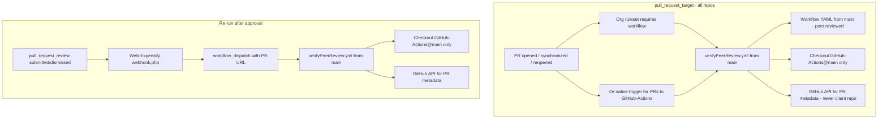

# Expensify Shared GitHub Actions workflows 🔄

## What is the repository used for?

Expensify has multiple repositories that use the same GitHub Actions workflows. This repository centralizes and consolidates frequently used workflows to enhance security and maintain consistent standards across projects.

## Usage

### `npmPublish.yml`

Used to publish a package to [npmjs](https://www.npmjs.com/), should be triggered when code is merged into the `main` branch. **Note**: Please follow [these instructions](https://stackoverflowteams.com/c/expensify/questions/17043/17044#17044) to grant our bots the correct access to publish.

```yml
jobs:
  publish:
    uses: Expensify/GitHub-Actions/.github/workflows/npmPublish.yml@main
    secrets: inherit
    with:
      # Repository name with owner. For example, Expensify/eslint-config-expensify
      # Required, String, default: ${{ github.repository }}
      repository: ""

      # True if we should run npm run build for the package
      # Optional, Boolean, default: false
      should_run_build: true
```

### `cla.yml`

Used to check if a user has signed the [Contributor License Agreement](./CLA.md), Should be triggered when a PR is opened or updated.

```yml
jobs:
  CLA:
    uses: Expensify/GitHub-Actions/.github/workflows/cla.yml@main
    # Required to pass along secrets for `CLA_BOTIFY_TOKEN`
    secrets: inherit
```

### `verifyPeerReview.yml`

Org-level ruleset workflow to block pull requests that lack an independent employee approval — e.g. when an employee self-approves a pull request they asked Melvin to create.

The check uses the GitHub API for PR metadata (authors, base branch, reviewers). It never checks out or executes code from the repo where the PR lives.

**Disclaimer:** this workflow is currently a no-op that will always pass.

#### How it runs



#### Triggers

| Trigger | Who fires it | Secrets (incl. fork PRs) | Workflow YAML source | Script checkout |
| ------- | ------------ | ------------------------ | -------------------- | --------------- |
| `pull_request_target` | Org ruleset on all repos (incl. GitHub-Actions); also auto-fires on PRs to GitHub-Actions once the workflow is on `main` | Yes | `main` (default branch) — not PR head | `GitHub-Actions@main` only |
| `workflow_dispatch` | PHP webhook on `pull_request_review` ([`webhook.php`](https://github.com/Expensify/Web-Expensify/blob/main/partners/github/webhook.php); follow-up work) | Yes | `main` | `GitHub-Actions@main` only |

`pull_request` is intentionally not used: it runs workflow YAML from the PR merge ref, which would allow unreviewed workflow changes to execute. `pull_request_review` is not supported by rulesets.

#### Security

- `pull_request_target` runs the workflow file from `main`, not the PR head — workflow changes in an open PR are not executed.
- Only `GitHub-Actions@main` is checked out for scripts; `checkoutRepoAndGitHubActions` must not be used because it checks out the client repo.
- Fork PRs are supported: secrets are available via `pull_request_target`, but untrusted code is never checked out or executed.

**Development tradeoff:** workflow and script changes in an open PR are not exercised in CI until merged to `main`. Validate via local `npm run verify-peer-review`, post-merge ruleset Evaluate mode, or `workflow_dispatch`.

#### Rollout

1. Merge the workflow to `main`.
2. Enable the ruleset (`pull_request_target`) in **Evaluate** mode on a test repo and GitHub-Actions.
3. Open or sync a PR; confirm the check passes and no client repo is checked out.
4. Switch the ruleset to **Active** and roll out org-wide (including GitHub-Actions).

See the "Rulesets" section below for general ruleset caveats.

### `setup-composer-cache`

Restores Composer download caches and optionally runs `composer install`. See [setup-composer-cache/README.md](./setup-composer-cache/README.md) for details.

```yml
- name: Setup Composer Cache
  uses: Expensify/GitHub-Actions/setup-composer-cache@main
  with:
    run_install: true
    dev: false
```

## Rulesets

GitHub [org-level rulesets](https://docs.github.com/en/enterprise-cloud@latest/repositories/configuring-branches-and-merges-in-your-repository/managing-rulesets/available-rules-for-rulesets#require-workflows-to-pass-before-merging) can be configured to run a workflow check against pull requests in all repos in the org. This is a very powerful feature, but there are some caveats and best practices to be aware of when enabling a ruleset.

- Supported Event Triggers are documented [here](https://docs.github.com/en/enterprise-cloud@latest/repositories/configuring-branches-and-merges-in-your-repository/managing-rulesets/available-rules-for-rulesets#supported-event-triggers). However:
  - When a workflow runs in response to a ruleset, some configs such as `branches`, `paths`, `paths-ignore`, that would normally be valid in a workflow are ignored.
  - The default activity types for each event will be used. This means that something like `pull_request:comment` will not work - the `pull_request` event will always be triggered for the default activity types listed in the documentation.
  - If you need to target or exclude specific branches, that can be configured in the ruleset settings.
  - If you need to target or exclude specific paths, that must be implemented manually in the workflow itself.
- Due to a GitHub :bug:, PRs that are open when the rule is enabled will get stuck with a pending check that will never get picked up. The easiest way to fix that is to close and reopen the PR. Consider writing a script to close and reopen all open PRs across the org after the check is enabled.
- It is less disruptive to [configure the ruleset to `Evaluate` first](https://docs.github.com/en/enterprise-cloud@latest/repositories/configuring-branches-and-merges-in-your-repository/managing-rulesets/available-rules-for-rulesets#using-evaluate-mode-for-ruleset-workflows), then `Active` once the kinks are worked out.
